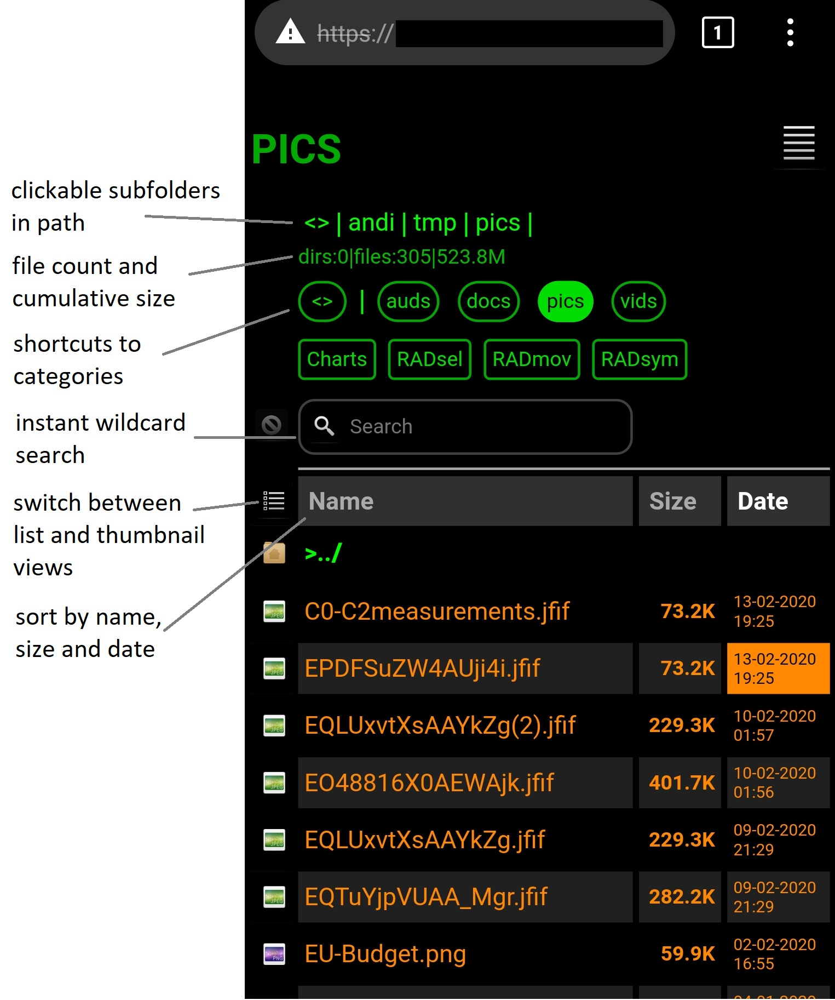
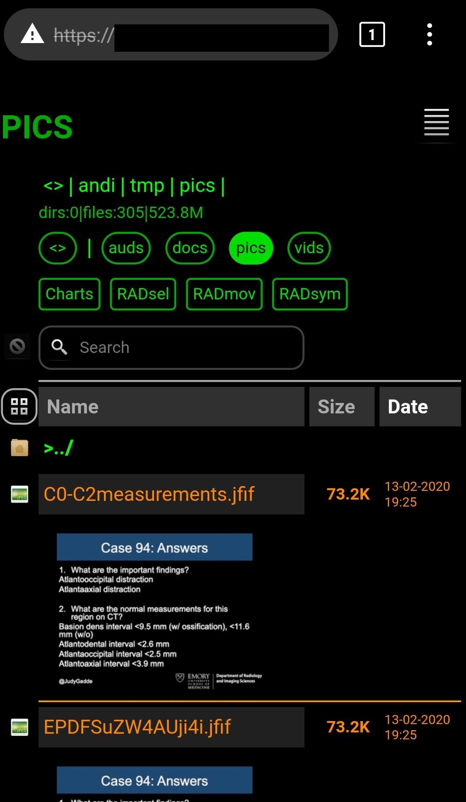
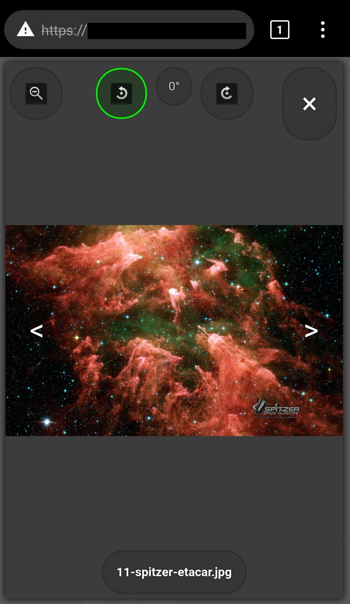

# RaspiCloud
Simple script-based, private cross-platform Cloud using Raspberry-Pi as Server with ssl-encrypted Web Interface.

## Features
- *lightweight:* based on *OpenSSH*, linux tools 'rsync', 'cron' and bash scripts
- *secure:* ssh-based file transfer (password protected or key-based)
- *convenient:* nginx ssl-encrypted web interface for file browsing with image gallery functions
- *cross-platform:* client-side linux environment available on many platforms
- *low cost:* using Raspberry-Pi as server with standard USB storage as NAS 
- syncs clients automatically to cloud storage
- automatic thumbnail generation
- automatic categorization of synced files in audio, video, documents and pictures
- guest access possible
- no 'rooting' of android devices required

## Requirements
- client requires termux (android) or cygwin (windows) environment

  https://play.google.com/store/apps/details?id=com.termux&hl=en  
  https://cygwin.com/
- linux server (tested with Raspian Stretch on a Raspberry 3b+) with nginx web server and ssh client installed
- NAS storage (tested with low cost 2.5 inch portbale, ext4-formatted USB-Harddisk attached to the raspberry pi)
- imagemagick v6 and libreoffice v5 for thumbnail generation (server-side)
- a file manager for browsing with ssh support (e.g. mxeplorer, solidexplorer and others under android support ssh including key based authentication and are available on google playstore)
- a standard webbrowser on the client, e.g. firefox

## Dependencies
### Web Interface:
  - *yall* lazy image loader by malchata:
   https://github.com/giventofly/yall
    
  - *Faenza Icons* theme by tiheum:
   https://www.deviantart.com/tiheum/art/Faenza-Icons-173323228
   
  - *Cssbox* image-gallery by TheLastProject:
   https://www.cssscript.com/css-only-minimal-responsive-image-gallery-lightbox-cssbox/
   
  - *BetterListing* by DevCoster:
   https://gitlab.com/devCoster/BetterListing
   
   - *jquery v3.4.1*:
   https://jquery.com/download/
   
## Coding
geany v1.29 under Raspian Stretch
- HTML / XSLT
- javascript & jquery
- bourne-shell

## Installation
### Install Client:
  **Raspbian Server:** 
  - create directory for client-installation files under a privileged user's account (e.g., 'pi'):
  
    ```mkdir ~/client-install-files```
    
  - copy the files in RaspiCloud/server/ to ~/ and the files in RaspiCloud/client-install-files/ to ~/client-install-files/.   
  - copy private/public keys of privileged user to ~/client-install-files/ssh (and remove them after installation is finished).
  
  **Android Client:**
  - Install Termux app (see google playstore).
  - open Termux and install openssh:
  
    ```pkg install openssh```
  
  - copy install script from server:
  
    ```scp pi@IP-ADDRESS:client-install-files/install_client.sh $HOME/```
    
    ```chmod +x $HOME/install_client.sh```
  
  - execute it:
  
    ```./install_client.sh```
  
  - after that, create new ssh keypair:
  
    ```ssh-keygen -t rsa -b 2048 -f id_rsa```
    
    and update authorized_keys on server.
   
### Install Nginx Web-Server for File Browsing:
  - install nginx and openssl, apache2-utils (for htpasswd), imagemagick & libreoffice (for thumbnails):
    
    ```sudo apt-get install nginx openssl apache2-utils imagemagick libreoffice```
  - create self signed certificate for ssl encryption:
   
    ```sudo openssl req -x509 -nodes -days 365 -newkey rsa:2048 -keyout /etc/nginx/nginx.key -out /etc/nginx/nginx.crt```
  - choose www-root-directory and link to NAS storage, e.g.
   
    ```sudo ln -s /media/cloud-NAS /var/www/html/cloud```
  - copy .css, .js, .xsl(t),... files in RaspiCloud/nginx/webroot/cloud to www-root/cloud
  - create user/password pair:
   
    ```sudo htpasswd -c /etc/nginx/.htpasswd USER```
  - adapt nginx 'default' configuration file in /etc/nginx/sites-available (see example in RaspiCloud/nginx/sites-available)
  - restart nginx:
   
    ```sudo service nginx restart```

## Screenshots
<table>
<tr>
<td>Dark themed layout. Design inspired by <a href="https://gitlab.com/devCoster/BetterListing">BetterListing</a>.</td>
<td>Thumbnail view.</td>
<td>Gallery with image manipulation based on <a href="https://www.cssscript.com/css-only-minimal-responsive-image-gallery-lightbox-cssbox/">cssbox</a>.</td>
</tr>
<tr>
<td></td>
<td></td>
<td></td>
</tr>
</table>

## Status
 experimental

## Disclaimer
The material embodied in this software is provided to you "as-is" and without warranty of any kind, express, implied or otherwise, including 
without limitation, any warranty of fitness for a particular purpose. In no event shall the author be liable to you or anyone else for any 
direct, special, incidental, indirect or consequential damages of any kind, or any damages whatsoever, including without limitation,
loss of profit, loss of use, savings or revenue, or the claims of third parties, however caused and on any theory of liability, arising
out of or in connection with the possession, use or performance of this software.
